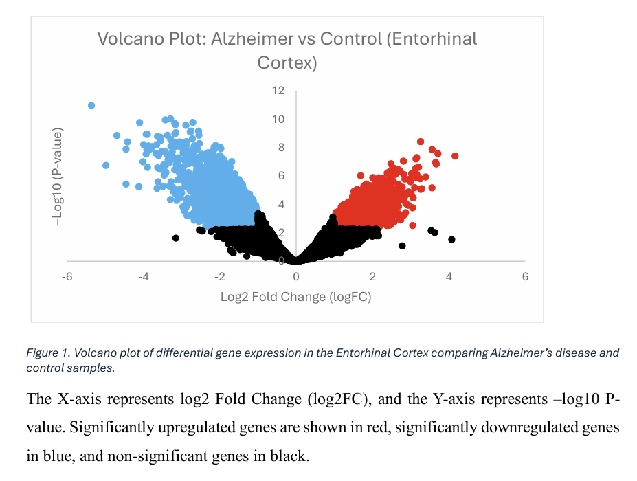

# Differential Gene Expression Analysis of Alzheimer’s Disease (Entorhinal Cortex)

## 📌 Project Overview

This project performs Differential Gene Expression (DEG) analysis using publicly available transcriptomic data from the Gene Expression Omnibus (GEO).

Dataset used:
- GEO Accession: GSE5281
- Organism: Homo sapiens
- Brain region: Entorhinal Cortex
- Comparison: Alzheimer’s disease vs Control

The analysis was conducted using the GEO2R web-based tool.

---

## 🎯 Objective

To identify significantly differentially expressed genes (DEGs) between Alzheimer’s disease and healthy control samples in the Entorhinal Cortex and interpret their biological relevance.

---

## ⚙️ Analysis Parameters

- Statistical method: limma (via GEO2R)
- Multiple testing correction: Benjamini–Hochberg (FDR)
- Significance criteria:
  - Adjusted p-value < 0.05
  - |log2 Fold Change| ≥ 1

---

## 📊 Results Summary

- Total genes analyzed: 54.675
- Significant DEGs identified: 5.665
  - Upregulated genes: 2.576
  - Downregulated genes: 3.089

The results demonstrate extensive transcriptional dysregulation in the Entorhinal Cortex of Alzheimer’s patients, characterized by increased immune-related gene expression and decreased neuronal function-related genes.

---

## 📈 Visualization

Volcano plot illustrating differential gene expression:

---

## 📂 Repository Structure

data/ → Dataset reference and metadata

results/ → GEO2R output files and volcano plot

report/ → Final PDF report

---

## 🔁 Reproducibility

The analysis was performed three times using consistent parameters to ensure reproducibility and robustness of the results.

---

## 🧬 Tools Used

- NCBI GEO Database
- GEO2R
- Microsoft Excel (data processing and visualization)

---

## 👤 Author

Naima Sahitya Andini  
Bioinformatics Project – Differential Expression Analysis
